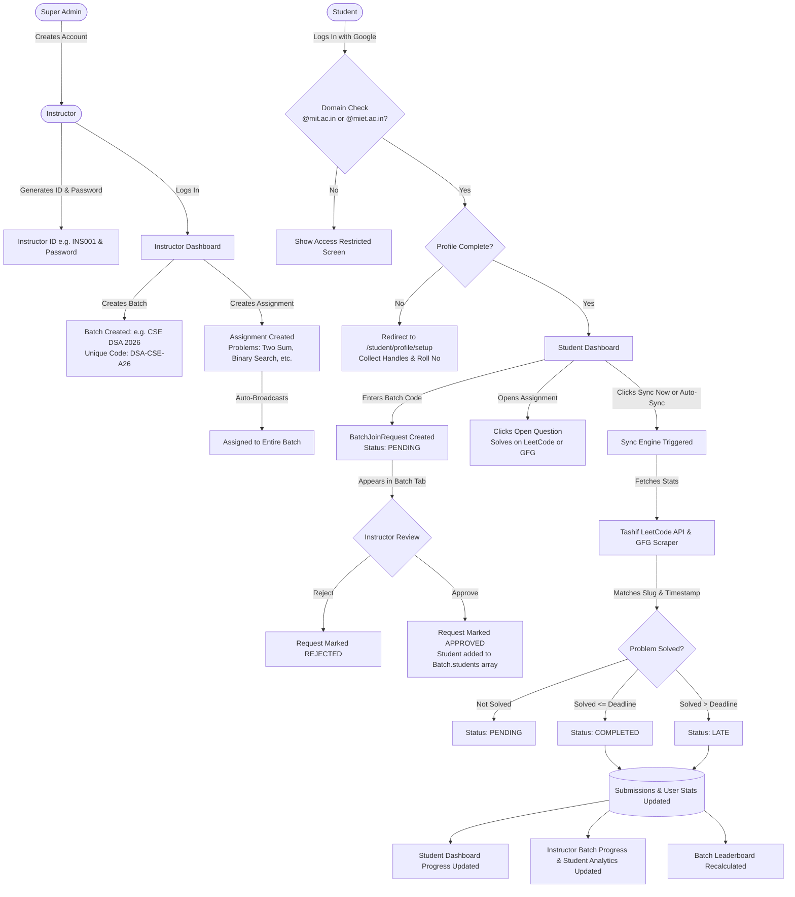
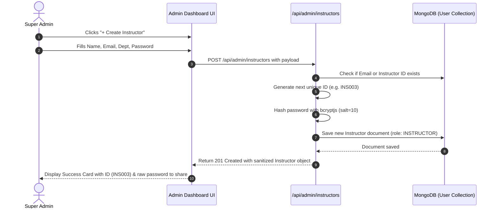
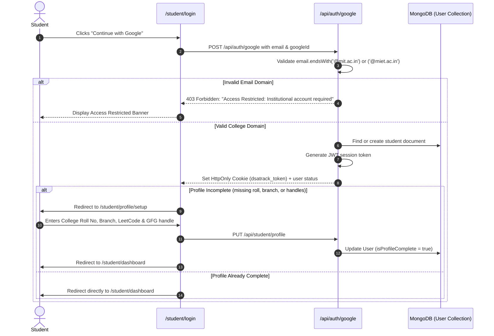
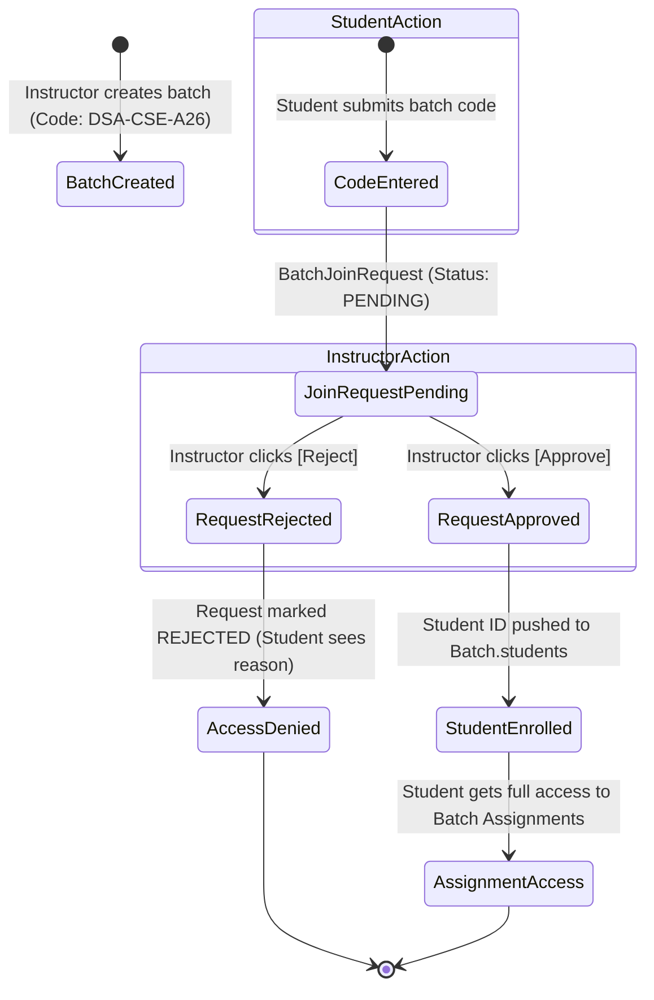
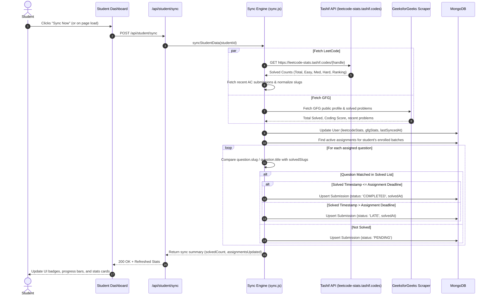
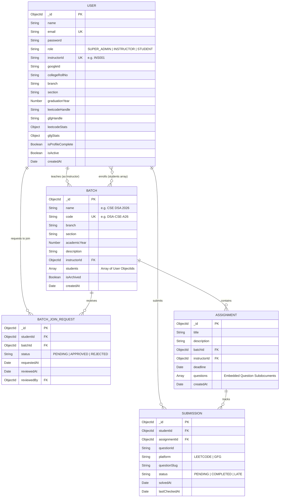

# DSATrack — Data Flow & Flowcharts

This document provides visual diagrams and Mermaid flowcharts representing all primary data flows, lifecycle states, and interactions within **DSATrack**.

---

## 1. Complete System Flowchart

The high-level end-to-end user and data journey from provisioning down to batch progress analytics:

---

## 2. Super Admin & Instructor Provisioning Flow

---

## 3. Student Domain-Enforced OAuth & Profile Setup Flow

---

## 4. Batch Lifecycle & Join Request Approval Flow

---

## 5. Platform Data Sync & Problem Matching Flow

---

## 6. Database Entity-Relationship Diagram (ERD)

