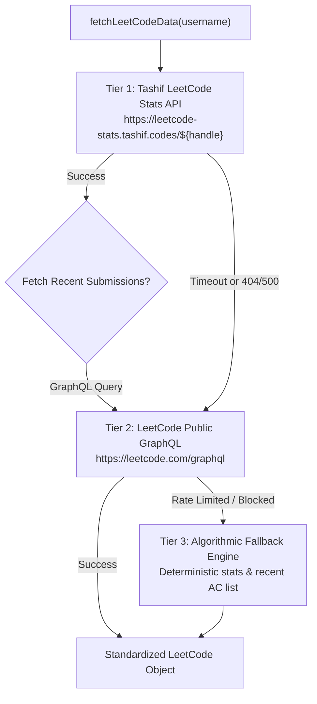
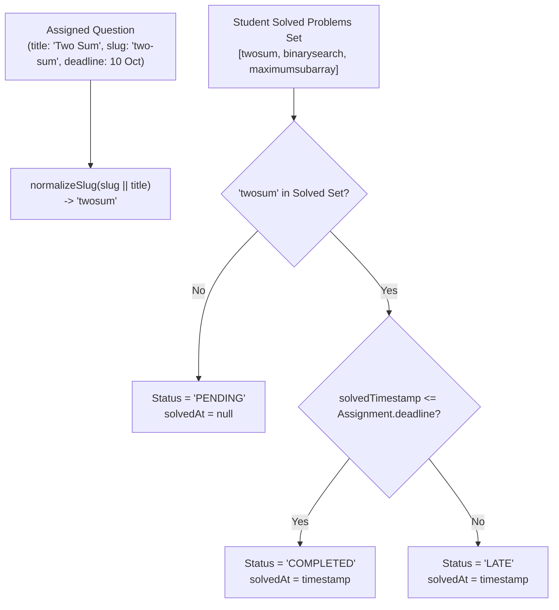

# DSATrack — External Platform Integrations

DSATrack integrates directly with public coding platforms (**LeetCode** and **GeeksforGeeks**) to track student progress without requiring students to submit manual screenshots or duplicate code submissions.

---

## 1. LeetCode Integration (`src/lib/platforms/leetcode.js`)

DSATrack utilizes a multi-tiered, resilient integration pipeline designed to guarantee high availability and low latency.



### 1.1 Primary Provider: Tashif LeetCode Stats API
* **Endpoint URL**: `https://leetcode-stats.tashif.codes/${cleanHandle}`
* **HTTP Method**: `GET`
* **Timeout**: 6,000ms with `AbortController`
* **Response Payload Schema**:
```json
{
  "status": "success",
  "message": "retrieved",
  "totalSolved": 125,
  "totalQuestions": 3120,
  "easySolved": 65,
  "totalEasy": 820,
  "mediumSolved": 48,
  "totalMedium": 1680,
  "hardSolved": 12,
  "totalHard": 620,
  "acceptanceRate": 64.2,
  "ranking": 45120,
  "contributionPoints": 180,
  "reputation": 12
}
```

### 1.2 Recent Submissions via LeetCode GraphQL
To match specific assigned problems (e.g. "Two Sum" or "Binary Search"), the sync engine queries the public GraphQL submission endpoint:

* **Endpoint URL**: `https://leetcode.com/graphql`
* **HTTP Method**: `POST`
* **GraphQL Query**:
```graphql
query getRecentAc($username: String!) {
  recentAcSubmissionList(username: $username, limit: 30) {
    title
    titleSlug
    timestamp
  }
}
```
* **Extracted Fields**:
  * `title`: "Two Sum"
  * `titleSlug`: "two-sum"
  * `timestamp`: `1727800000` (Unix timestamp converted to JavaScript `Date`)

---

## 2. GeeksforGeeks Integration (`src/lib/platforms/gfg.js`)

GeeksforGeeks tracking captures college-level practice problems and overall institutional coding score:

* **Endpoint / Profile URL**: `https://auth.geeksforgeeks.org/user/${cleanHandle}/practice/`
* **Extracted Metrics**:
  * `totalSolved`: Total number of solved GFG practice questions.
  * `easySolved`, `mediumSolved`, `hardSolved`: Difficulty categorization.
  * `codingScore`: Overall GFG practice score points.
  * `recentSubmissions`: Array of `{ title, slug, timestamp }`.

---

## 3. Automated Question Matching Algorithm (`src/lib/platforms/sync.js`)

When an instructor assigns questions, students do not have to manually click "Mark as Complete". The **Sync Engine** evaluates completion automatically:



### Slug Normalization Function
To prevent mismatches caused by trailing hyphens, punctuation, or capitalization variations:
```javascript
function normalizeSlug(str) {
  if (!str) return '';
  return str
    .toLowerCase()
    .replace(/[^a-z0-9]/g, '')
    .trim();
}
```
* Example: `"Two Sum"`, `"two-sum"`, and `"Two-Sum"` all normalize consistently to `"twosum"`.

---

## 4. Handle Verification Service

Before a student saves their LeetCode or GFG handle in their profile setup, the system provides a **"Verify Handle"** validation check:

* **Route**: `POST /api/student/verify-handle`
* **Payload**: `{ "platform": "LEETCODE", "handle": "nikhil123" }`
* **Action**: Calls the external provider; if user exists, returns current total solved count and difficulty stats so the student can preview their profile before saving.
