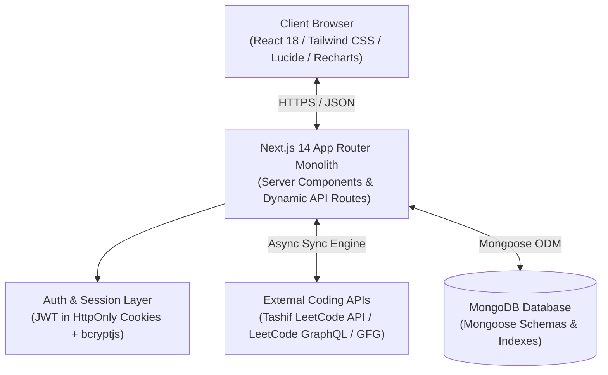

# DSATrack — College DSA Progress & Assignment Tracking Platform
## 📚 Complete Project Documentation

Welcome to the comprehensive documentation suite for **DSATrack**, a modern, monolithic, full-stack web application engineered for college Data Structures & Algorithms (DSA) instructors and students.

---

## 🎯 Executive Summary & Mission

College computer science departments often struggle to track their students' real-world problem-solving progress across competitive programming platforms like **LeetCode** and **GeeksforGeeks**. Instructors are left with manual spreadsheet tracking or self-reported student submissions, leading to friction, inaccuracy, and lack of transparency.

**DSATrack** solves this problem by providing a streamlined, automated ecosystem:
1. **Super Admin** provisions and manages verified **Instructor** accounts.
2. **Instructors** create departmental **Batches** (e.g. `CSE DSA 2026`) and distribute unique, human-readable **Batch Codes** (e.g. `DSA-CSE-A26`).
3. **Students** sign in strictly through their institutional Google accounts (`@mit.ac.in` or `@miet.ac.in`), join their respective batches via approval workflow, and connect their public coding handles.
4. **Instructors assign curated DSA problem sets** directly from LeetCode and GeeksforGeeks to entire batches.
5. The system automatically syncs student solve data using fast public APIs (including `leetcode-stats.tashif.codes`), matching solved problems against assigned questions and computing real-time completion statuses (`COMPLETED`, `PENDING`, `LATE`), batch leaderboards, and progress analytics.

---

## 🧭 Documentation Index

This documentation suite is organized into dedicated, comprehensive guides:

| Document | Description |
| :--- | :--- |
| **[1. System Design & Architecture](./SYSTEM_DESIGN.md)** | Monolithic architecture, component layers, role security, session management, and design trade-offs. |
| **[2. Data Flow & Flowcharts](./DATA_FLOW_AND_FLOWCHARTS.md)** | Visual Mermaid diagrams covering user authentication, batch requests, assignment tracking, data sync, and ERD. |
| **[3. API Documentation Reference](./API_DOCUMENTATION.md)** | Complete specification of all RESTful Next.js API endpoints, request/response formats, parameters, and status codes. |
| **[4. Database Schema & Data Dictionary](./DATABASE_SCHEMA.md)** | Detailed Mongoose models (`User`, `Batch`, `BatchJoinRequest`, `Assignment`, `Submission`), field types, indexes, and relations. |
| **[5. External Platform Integrations](./EXTERNAL_INTEGRATIONS.md)** | In-depth technical breakdown of `leetcode-stats.tashif.codes`, LeetCode GraphQL, GFG integration, and slug matching logic. |
| **[6. Run, Build & Deployment Guide](./RUN_AND_BUILD_GUIDE.md)** | Step-by-step setup, environment variables, seeding instructions, development commands, production builds, and test credentials. |

---

## 🏗️ High-Level Technology Stack

* **Frontend**: Next.js 14 (App Router), React 18, Tailwind CSS, Lucide React icons, Recharts.
* **Backend**: Next.js API Route Handlers (Monolithic, Node.js runtime).
* **Database**: MongoDB (Local or MongoDB Atlas) using Mongoose ODM.
* **Authentication**: Google OAuth with institution domain validation (`@mit.ac.in`, `@miet.ac.in`) + ID/Email & bcrypt password authentication for Instructors and Super Admins.
* **External Integration**: `https://leetcode-stats.tashif.codes/${handle}`, LeetCode GraphQL, and GFG profile extractors.

---

## ⚡ Quick Test Credentials

If you are evaluating the platform locally, the database comes pre-populated with realistic demo accounts:

| Role | Login Identifier | Password / Auth Method | Direct URL |
| :--- | :--- | :--- | :--- |
| **Super Admin** | `admin@mit.ac.in` / `ADMIN001` | `admin123` | [`/admin/login`](http://localhost:3000/admin/login) |
| **Instructor** | `rahul@mit.ac.in` / `INS001` | `password123` | [`/instructor/login`](http://localhost:3000/instructor/login) |
| **Instructor** | `sunita@miet.ac.in` / `INS002` | `password123` | [`/instructor/login`](http://localhost:3000/instructor/login) |
| **Student** | `nikhil@mit.ac.in` | One-Click Google Login | [`/student/login`](http://localhost:3000/student/login) |
| **Student (New Setup)** | `kavya@mit.ac.in` | One-Click Google Login | [`/student/login`](http://localhost:3000/student/login) |

---

## 📖 Recommended Reading Path

1. To understand how the platform is structured and its design principles, read **[System Design](./SYSTEM_DESIGN.md)**.
2. To trace how data moves through the application, explore **[Data Flow & Flowcharts](./DATA_FLOW_AND_FLOWCHARTS.md)**.
3. To inspect or integrate with backend endpoints, consult **[API Documentation](./API_DOCUMENTATION.md)**.
4. To see how questions are mapped and fetched from Tashif's API, see **[External Integrations](./EXTERNAL_INTEGRATIONS.md)**.
5. To run, build, or deploy the project, follow **[Run, Build & Deployment Guide](./RUN_AND_BUILD_GUIDE.md)**.
