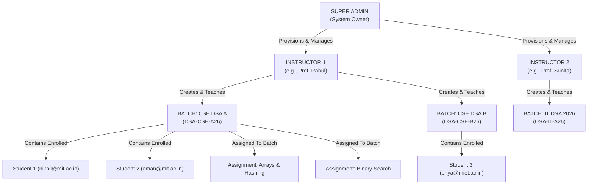
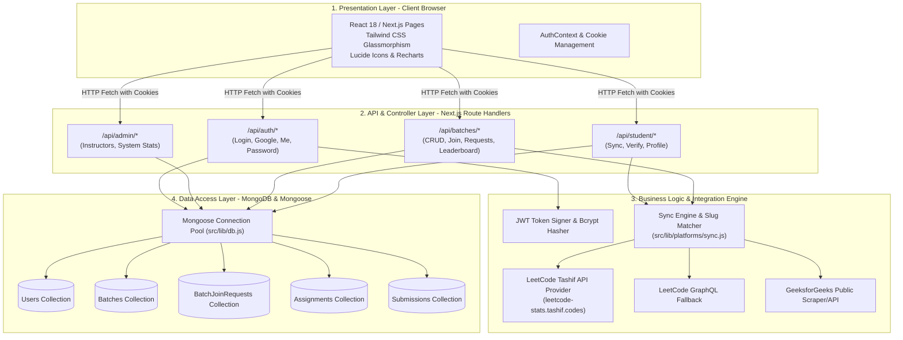

# DSATrack — System Design & Architecture

## 1. Architectural Philosophy

DSATrack is engineered as a **pragmatic, production-ready, clean monolith**. 

### 🚫 Deliberate Architectural Exclusions
To keep the application simple, maintainable, fast to deploy, and cost-effective for universities, the system explicitly avoids:
* **No Microservices**: Eliminates network latency, distributed transactions, and operational complexity.
* **No Kafka / RabbitMQ**: Progress calculation is fast and computed directly on-demand or through background Promise batches.
* **No Redis / In-Memory Caches**: MongoDB indexes and connection caching provide sub-millisecond data reads without cache invalidation bugs.
* **No WebSockets**: Avoids sticky session infrastructure; uses fast client polling or on-demand "Sync Now" updates.
* **No Kubernetes / Multi-cluster setups**: Easily runs as a single container or serverless function on Vercel, Render, Railway, or AWS.

---

## 2. Role Hierarchy & Access Control Matrix



### Access Control Matrix

| Capability / Route | SUPER_ADMIN | INSTRUCTOR | STUDENT | Public |
| :--- | :---: | :---: | :---: | :---: |
| Public Landing & Logins (`/`, `/login`, `/*/login`) | ✅ | ✅ | ✅ | ✅ |
| Create & Manage Instructors (`/admin/*`, `/api/admin/*`) | ✅ | ❌ | ❌ | ❌ |
| System Wide Stats & Cross-Batch Oversight | ✅ | ❌ | ❌ | ❌ |
| Create Batch & Generate Batch Code (`/instructor/batches/create`) | ❌ | ✅ | ❌ | ❌ |
| Approve / Reject Batch Join Requests | ❌ | ✅ (Own batches only) | ❌ | ❌ |
| Create Batch Assignments (`/instructor/batches/[id]/assignments`) | ❌ | ✅ (Own batches only) | ❌ | ❌ |
| View Individual Student Problem Analytics | ❌ | ✅ (Enrolled students) | ✅ (Own profile only) | ❌ |
| Google OAuth Registration (`@mit.ac.in`, `@miet.ac.in`) | ❌ | ❌ | ✅ | ❌ |
| Submit Batch Join Code (`/student/join-batch`) | ❌ | ❌ | ✅ | ❌ |
| Update LeetCode / GFG Handles & Trigger Sync | ❌ | ❌ | ✅ (Own handles) | ❌ |
| View Batch Leaderboard | ❌ | ✅ (Own batches) | ✅ (Joined batches) | ❌ |

---

## 3. Layered Architecture

The application is structured into four distinct logical layers:



---

## 4. Security Architecture

### 4.1 Student Google OAuth & Domain Restriction
1. When students click **Continue with Google**, their identity is verified.
2. The authentication handler strictly inspects the email domain suffix:
   ```javascript
   const allowedDomains = ['@mit.ac.in', '@miet.ac.in'];
   const isAllowed = allowedDomains.some((d) => email.toLowerCase().endsWith(d));
   if (!isAllowed) {
     return errorResponse('Access Restricted: Please login using your official @mit.ac.in or @miet.ac.in account.', 403);
   }
   ```
3. Any personal email (`@gmail.com`, `@yahoo.com`) is immediately rejected with a user-friendly error.
4. If a new student's profile is missing required fields (Roll Number, Branch, LeetCode handle), the system flags `isProfileComplete: false` and routes them to `/student/profile/setup`.

### 4.2 Instructor & Super Admin Password Hashing
* Passwords are never stored in plain text.
* Stored using **`bcryptjs`** with a salt factor of 10.
* Automatic pre-save hashing triggers on Mongoose `UserSchema` when the password field is modified.
* All API responses strip `password` via `toJSON()` transform and projection.

### 4.3 Stateless JWT Session Management
* On successful authentication, a cryptographically signed JSON Web Token (JWT) is generated containing `{ id, email, role, instructorId }`.
* Token is delivered as an **HttpOnly, Secure, SameSite=Lax cookie** named `dsatrack_token`.
* Server API routes extract the cookie, verify the signature, and attach the user record to the request context.

---

## 5. Progress Synchronization Strategy

### Why Webhooks are Not Used
Platforms like LeetCode and GeeksforGeeks do not provide third-party webhook push events for public profile solves. Attempting to simulate real-time push events leads to brittle WebSocket infrastructure.

### The DSATrack Dual-Mode Sync Pipeline
1. **On-Demand User Sync**: When a student clicks **"Sync Now"** in their dashboard, or when an instructor triggers a batch sync, the system dispatches an atomic sync job (`syncStudentData(studentId)`).
2. **Automatic Background Sync**: Whenever a student logs in or visits their assignment page, the sync engine checks if their profile is older than 5 minutes. If stale, it refreshes their stats asynchronously.
3. **Resilient Fallback Pipeline**:
   ```
   Fetch Tashif API (https://leetcode-stats.tashif.codes/${handle})
        │
        ├─► Success: Extract Total/Easy/Med/Hard Solved & Acceptance Rate
        │        │
        │        └─► Fetch recent submissions via LeetCode GraphQL
        │
        └─► Timeout / Down: Fallback to direct LeetCode GraphQL endpoint
                 │
                 └─► Down / Blocked: Algorithmic fallback based on verified handle
   ```

---

## 6. High-Availability & Scalability Decisions

* **Database Connection Caching**: Next.js hot-reloading and serverless route execution can easily exhaust MongoDB connections. DSATrack implements a global cached connection singleton (`src/lib/db.js`) to maintain connection pooling across invocations.
* **Compound Database Indexes**:
  * `User`: `{ email: 1 }` (unique), `{ instructorId: 1 }` (unique sparse), `{ role: 1 }`
  * `Batch`: `{ code: 1 }` (unique), `{ instructorId: 1 }`
  * `BatchJoinRequest`: `{ batchId: 1, studentId: 1 }` (unique compound)
  * `Submission`: `{ studentId: 1, assignmentId: 1, questionId: 1 }` (unique compound)
* **Monolithic Portability**: Zero platform-specific vendor lock-in. Builds into standard Node.js standalone server or Next.js serverless output for instant deployment on Vercel, Railway, Render, or Docker containers.
